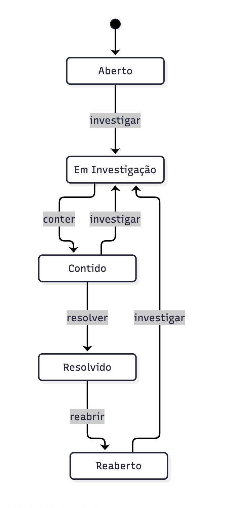
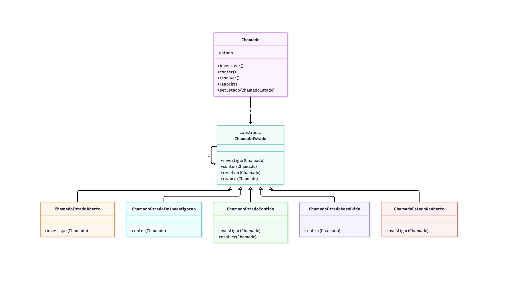

# State — Chamado de Incidente de Segurança

Implementação do padrão de projeto **State**, aplicada ao ciclo de vida de um chamado de incidente de segurança.


## Máquina de estados



Versão editável em Mermaid: [docs/diagrama-estados.md](docs/diagrama-uml.md).

## Diagrama UML



Versão editável em Mermaid: [docs/diagrama-uml.md](docs/diagrama-uml.md).

## Como rodar os testes

```
mvn test
```
