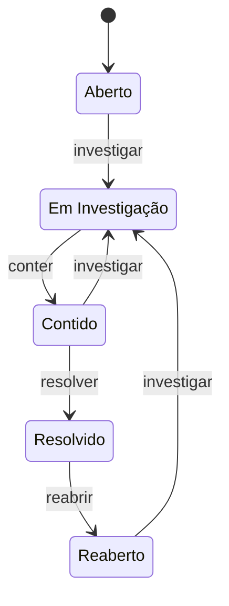

# Diagrama de Estados — State (Chamado de Incidente de Segurança)

```mermaid
stateDiagram-v2
    state "Em Investigação" as EmInvestigacao

    [*] --> Aberto
    Aberto --> EmInvestigacao : investigar
    EmInvestigacao --> Contido : conter
    Contido --> EmInvestigacao : investigar
    Contido --> Resolvido : resolver
    Resolvido --> Reaberto : reabrir
    Reaberto --> EmInvestigacao : investigar
```
