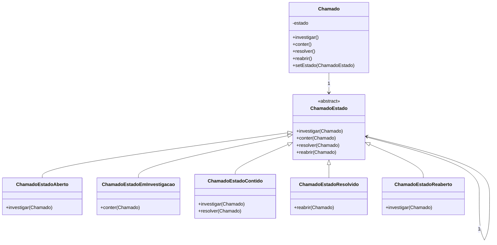

# Diagrama UML — State (Chamado de Incidente de Segurança)

```mermaid
classDiagram
    class Chamado {
        -estado
        +investigar()
        +conter()
        +resolver()
        +reabrir()
        +setEstado(ChamadoEstado)
    }

    class ChamadoEstado {
        <<abstract>>
        +investigar(Chamado)
        +conter(Chamado)
        +resolver(Chamado)
        +reabrir(Chamado)
    }

    class ChamadoEstadoAberto {
        +investigar(Chamado)
    }

    class ChamadoEstadoEmInvestigacao {
        +conter(Chamado)
    }

    class ChamadoEstadoContido {
        +investigar(Chamado)
        +resolver(Chamado)
    }

    class ChamadoEstadoResolvido {
        +reabrir(Chamado)
    }

    class ChamadoEstadoReaberto {
        +investigar(Chamado)
    }

    Chamado --> ChamadoEstado : 1
    ChamadoEstado --> ChamadoEstado : 1
    ChamadoEstado <|-- ChamadoEstadoAberto
    ChamadoEstado <|-- ChamadoEstadoEmInvestigacao
    ChamadoEstado <|-- ChamadoEstadoContido
    ChamadoEstado <|-- ChamadoEstadoResolvido
    ChamadoEstado <|-- ChamadoEstadoReaberto
```
